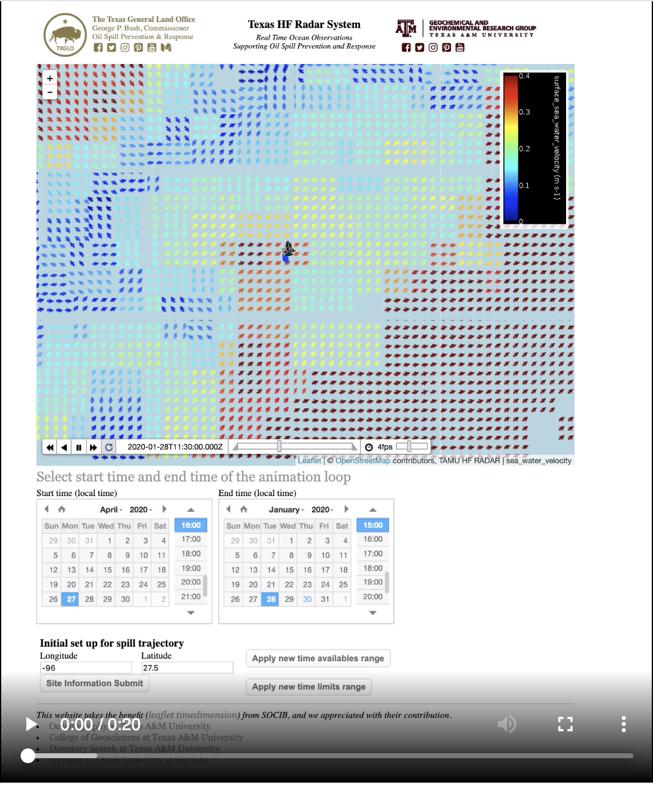

# Particle Trajectories using High Frequency Radar

#### Project Structure

	> {'Project short name': 'ParTHdar',
	>  'Project long name': 'TGLO Particle tracking using High-Frequency Radar',
	>  'Funding Source': 'Texas General Land Office', 
	>  'Project PI': 'Kerri Whilden',
	>  'Project co-PI': 'Steve DiMarco',
	>  'Web Creator': 'Chuan-Yuan Hsu',
	>  'Institute': 'Geochemical and Environmental Research Group - Texas A&M University',
	>  'Institute': 'Gulf of Mexico Ocean Observing System',
	>  'Publisher': 'Zenodo',
	>  'Backend': 'Python - Flask', 
	>  'Frontend': 'Javascript - leaflet, leaflet timedimension'}

##### Screen Shot
](https://youtu.be/OPkEODS-lZQ)

##### How to cite this toolbox.
Chuan-Yuan Hsu, Kerri Whilden, Steve DiMarco, & Brian Buckingham. (2019, August 26). Pre-Release: Particle Trajectories by Utilizing High-Frequency Radar (Version v0.9-alpha). Zenodo. http://doi.org/10.5281/zenodo.3377881    

